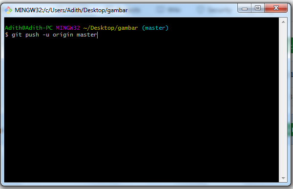

# latihan VCS

Nama : Marlina Horo

Nim :312010250

kelas : TI.20 A2

1. Langkah pertama membuat folder **latihanVCS** , saya membuat folder nya di desktop

2. Klik kanan pada Folder yang sudah di buat tadi lalu klik terminal lalu akan muncul seperti gambar di bawah ini:

3. Kemudian buatlah folder dengan mengetik di terminal dengan perintah `mkdir latihan1`

dan nantinya di folder **latihanVCS** dan didalam nya akan ada folder baru dengan tulisan seperti yang tadi kita ketik di terminal yaitu **latihanVCS**

4.  Langkah selanjut nya masuk kedalam folder **latihanVCS** dengan mengetik `cd latihanVCS`

5. Dan buatlah Folder tersebut menjadi repo (repository) dengan cara **git init** jika benar akan seperti gambar di bawah ini:

jika sudah seperti ini artinya folder sudah menjadi repo.

6. Setelah itu buat file README.md dengan mengetik `echo "latihanVCS" >> README.md`

7. Sekarang kita ketik perintah `ls -l` dan penampilan akan seperti ini

8. di lanjutkan dengan mengetik `git add README.md`

9. Cara mengecek file tersebut ketik `git status` maka akan muncul sebagai berikut.

10. Langkah selanjutnya commit file tersebut `git commit -m “pesan”`

jika tidak ada masalah maka akan seperti gambar di atas.

11. langkah selanjutnya buat lah akun di github (http://github.com)

12. Jika sudah memiliki akun buat lah repository baru **New Repository**

13. Langkah selanjutnya mengisi repository nya

- **isi repository nya dengan nama “latihanVCS” ,untuk penamaan bisa di rubah sesui keperluan.**

- **untuk description / pesan buat lah sejelas mungkin.**

- **pilih lah public**

- **lalu create repository**

14. copy link tersebut untuk menghubungkan dengan akun git yang ada di pc/ laptot.

15. Lalu buka lah **terminal** Cara menghubungkan nya dengan mengetik git remote add origin <link> 

15. Langkah selanjutnya ketik `git push -u origin master` lalu masukan username GITHUB dan password 

16. Bila tidak ada kesalahan akan seperti gambar di bawah ini

# pengertian 

- `mkdir <nama file>` untuk membuat file baru

- `git init` untuk membuat depository local

- `git add` untuk menambah kan file baru

- `git status` untuk mengecek apakah ada perubahan di dalam file

- `git commit` untuk menyimpan perubahan kedalam database git.

- `git remote` untuk menghubungka file ke github

- `git push` untuk meng upload file ke github
